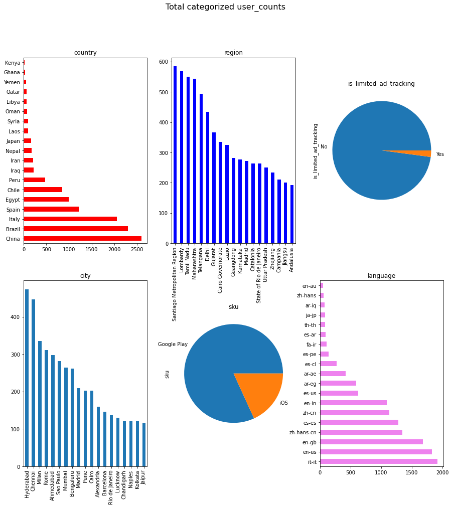

Shivaji parala
===========================================================

# Halfbricks code task

## Essential tasks

First three tasks where in represented in data_analysis.py file with three function:

*csv_json : converts csv file to json file. 

output for sandbox csv file:  https://raw.githubusercontent.com/pshivaji/Halfbrick/main/results/task1_results.json

*data_summary: Gives the summary of data or data insights in different plots . Below plot are user counts based on different category.



*sql_insert: Convert csv file to sql statements 

https://raw.githubusercontent.com/pshivaji/Halfbrick/main/results/task3_results.txt
'''

The python solution involves user input (Name of the csv file, if file is "sandbox.csv" just type sandbox) can be run using command prompt.

```bash
$ python data_anaysis.py
```

More like a game, user can choose which function to perform  on the csv file provided.

Three messages which will appearning when user run the code are 

```bash
Do you want convert csv to json file(y/n):
Do you want summary of the data(y/n):
convert to sql statements(y/n):
```

User can choose yes or no depending the requirement they have.


## Optional tasks:

### Runnning in Dockaer container

Docker file was created adding the commands to exicute the python script

Command to create a docker image (my-python-app)

```bash
$ docker build -t my-python-app .
```

Command to run the image in a container

```bash
$ docker run -it --rm --name my-running-app my-python-app
```

## pip Packaging and publishing

                     codetestsol

                          |
                          |
                          |

                      functions

                          | 
                          |  
                          |
          ---------------------------------
          |               |               |      
          |               |               |
          |               |               |               
      csv_json       data_summary     sql_insert

I have used Setup tools and twine packages to generate package and publish it in pip.

You can access the package for this python solution by 

```bash
pip install codetestsol
```
You can find the package info here https://pypi.org/project/codetestsol/0.0.1/

Futher commands in python access the functions:

```bash
from codetestsol import functions
```

```bash
functions.csv_json("sample.csv")  
functions.data_summary ("sample.csv") 
functions.sql_insert("sample.csv") 
```
User must provide the input csv file as "filename.csv"


